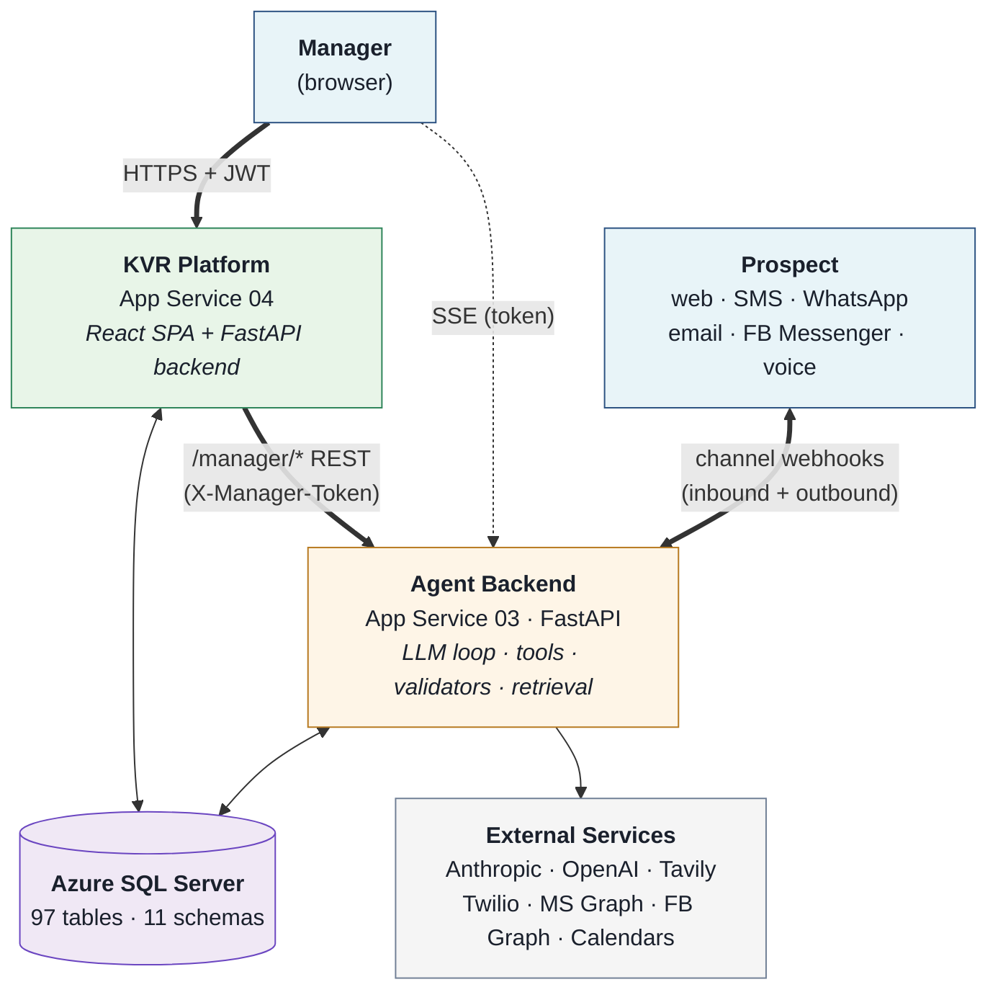
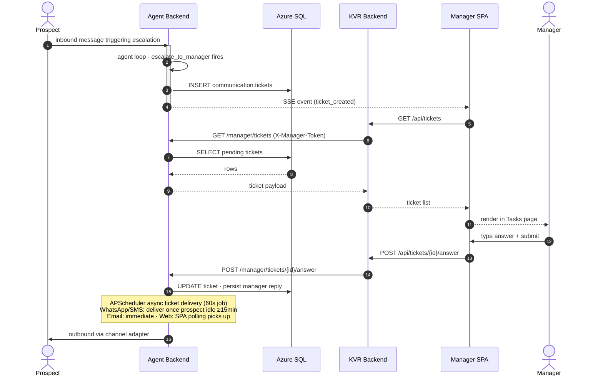

# Kelly / KVR Platform — System Architecture

**Audience:** Technical advisor onboarding to the system.
**Scope:** End-to-end architecture across the three core pieces — agent backend, web platform, shared database.
**Source:** Synthesized from the agent backend architecture summary and the KVR Platform architecture summary. This document is the cross-system reference; the two source documents remain authoritative for component-internal detail.

---

## 1. Headline diagram



Three subsystems share a single Azure SQL database. Three integration seams connect them: browser → KVR over HTTPS+JWT for direct DB-backed reads and writes; browser → Agent over SSE for live updates on the Tasks page; KVR backend → Agent over HTTP for proxied manager actions under `/manager/*`. External services are agent-side only — the web platform talks to no third parties beyond Azure SQL itself. The internals of each piece are shown in the request lifecycle (§3) and manager workflow (§4) below.

---

## 2. The three pieces

### Agent backend

A single FastAPI process deployed to Azure App Service `appservice-03`. Six prospect-facing channels — web chat, SMS, WhatsApp, email, Facebook Messenger, and voice — converge on `api/chat/service.handle_chat_message()`. From there, every conversation runs through the same agent loop: Anthropic Haiku 4.5 with extended thinking enabled, a static system prompt, a static catalog of ten tools, and four pre-response validators that sit between the LLM output and the prospect.

The retrieval pipeline is the most distinctive component. Two parallel knowledge bases — tenant-authored property Q&A and a fair-housing legal rulebook — are queried in a single tool call. FAISS surfaces candidates from each, the merged list goes to a gpt-4o-mini classifier, and the citations the classifier returns drive code-level escalation logic. This is the structural mechanism for compliance: regulated-topic correctness depends on cited rules and code branches, not on the model getting it right every time.

The agent is also where all external service integrations live: Anthropic and OpenAI for inference, Tavily for web-search fallback, Twilio for telephony channels, Microsoft Graph for email, Facebook Graph for Messenger, and the calendar providers (Azure DB-backed in production, Google in dev).

### Web platform (KVR Platform)

A separate repository, separate App Service (`appservice-04`), separate team historically. The frontend is a React 18 + Vite SPA deployed to Azure Static Web Apps. The backend is FastAPI 0.115 on uvicorn in a Docker container, 103 REST routes spread across 26 router files, with 53 SQLAlchemy ORM classes mapped onto the agent team's schema.

The SPA is the operator surface. Pages cover prospects, residents, conversations, the tour calendar, the analytics journey funnel, and a Tasks sub-app for human-in-the-loop work — tickets, community tasks, tour follow-ups, paused conversations, upcoming bookings. There's also full CRUD admin coverage for units, fees, communities, knowledge entries, amenities, floor plans, and media.

The KVR backend has two distinct response patterns. Most routes are direct DB reads and writes through SQLAlchemy. A subset — anything under `/manager/*` — proxies through to the agent service over HTTP, because the agent is the source of truth for ticket and task state.

### Database

One Azure SQL Server 2022 instance (`kvr-kvr-dev-eus-sql-02`), 97 tables across 11 schemas, shared between the two services. Both connect directly. The agent uses raw SQL written in Postgres dialect with a translation layer that targets either Postgres (dev) or T-SQL (production Azure SQL) — the same code runs against either backend. The KVR backend uses SQLAlchemy 2.0 with the pyodbc driver over ODBC Driver 18.

The schema split corresponds to functional domains: `core` for tenants, users, and roles; `community` for properties, units, knowledge, and media; `prospects` for lead records; `communication` for conversations, tickets, tasks, and follow-ups; `tour` for calendar events and booking state; `compliance` for fair housing rules; `analytics` for LLM cost tracking; `residents` for resident details and charges; `leasing` for fees; `crm` for the read-only India-CRM mirror.

---

## 3. Request lifecycle: prospect message → response

This is the core synchronous flow and the most useful mental model for the system. A single inbound prospect message traverses every layer:

```
                Prospect (any of six channels)
                            │
                            ▼ inbound HTTP / webhook
   ┌────────────────────────────────────────────────────────┐
   │ 1. Channel adapter (api/{chat,sms,whatsapp,email,…})   │
   │    Signature validation · protocol normalization       │
   └────────────────────────────────────────────────────────┘
                            │
                            ▼
   ┌────────────────────────────────────────────────────────┐
   │ 2. Unified entry — handle_chat_message()               │
   │    • Tenant resolution by channel + identifier         │
   │      (communication.tenant_channels → community_id)    │
   │    • Cross-channel identity merge by phone/email       │
   │    • Conversation history load from JSON column        │
   └────────────────────────────────────────────────────────┘
                            │
                            ▼
   ┌────────────────────────────────────────────────────────┐
   │ 3. Agent loop — agent/loop.run_agent_loop()            │
   │    • Inject booking state + date-resolution into msg   │
   │    • Anthropic messages.create with thinking enabled   │
   │      and the interleaved-thinking-2025-05-14 beta      │
   │    • Static system prompt + 10-tool catalog            │
   │    • Iterative tool dispatch (max 10 iterations)       │
   └────────────────────────────────────────────────────────┘
                            │
        ┌───────────────────┼───────────────────┐
        ▼                   ▼                   ▼
   ┌──────────┐      ┌─────────────┐     ┌──────────────┐
   │  Tools   │      │ KB retrieval│     │ Calendar /   │
   │ (10)     │      │ (FAISS →    │     │ booking      │
   │          │      │  gpt-4o-    │     │ (Azure prod, │
   │          │      │  mini)      │     │  Google dev) │
   └──────────┘      └─────────────┘     └──────────────┘
        │                   │                   │
        └───────────────────┼───────────────────┘
                            ▼
   ┌────────────────────────────────────────────────────────┐
   │ 4. Response validation (4 validators in sequence)      │
   │    • PG3 booking-confirmation gate                     │
   │    • Empty-response gate                               │
   │    • Rent-attestation gate                             │
   │    • Repeat-CTA gate                                   │
   │    Up to one retry with correction message on reject.  │
   └────────────────────────────────────────────────────────┘
                            │
                            ▼
   ┌────────────────────────────────────────────────────────┐
   │ 5. Persistence + outbound dispatch                     │
   │    • Persist response to communication.conversations   │
   │    • Persist token usage to analytics.llm_usage        │
   │    • Outbound via channel-specific path:               │
   │       — Web: HTTP response body                        │
   │       — Twilio: REST call                              │
   │       — Email: MS Graph send                           │
   │       — FB: Send API                                   │
   └────────────────────────────────────────────────────────┘
                            │
                            ▼
                       Prospect
```

The whole synchronous path typically completes in two to eight seconds depending on tool calls. The validator stage is where the architecture's strongest claim lives: a model response that asserts a tour was booked when no booking tool returned success this turn cannot reach the prospect. The same pattern applies to rent attestations (no quoting unverified prices) and CTA repetition. These are code-level guards, not prompt directives.

The retrieval pipeline deserves one more note. Both knowledge bases — regular property Q&A and the fair-housing rulebook — are surfaced through a single tool call. The merged candidate list goes to a single Stage 2 invocation that returns ANSWER or ESCALATE plus the candidate IDs it cited. Code downstream of Stage 2 reads the citations to decide what to do: a fair-housing rule with `escalation_required=true` triggers a community task; a fair-housing rule cited in any context returns its `safe_response_pattern` text directly; nothing fair-housing cited and ESCALATE returned falls through to Tavily web search and a manager-validation draft.

---

## 4. Manager workflow: HITL ticket round-trip

When the agent's `escalate_to_manager` tool fires, control transfers to a human via the web platform. The full round-trip:



Two ticket types share this flow with different semantics. **HITL tickets** are synchronous from the manager's perspective — the manager's text becomes the next prospect-facing message. **Community tasks** are asynchronous validation: the agent has already drafted a response (typically from a Tavily fallback when the KB had no answer), the manager validates or rejects the draft, and validated drafts are folded into the knowledge base. Both are created by the same `escalate_to_manager` tool — the `owner` parameter switches between them.

The SSE channel only carries notifications; payloads are fetched via the REST proxy. This means the SPA can survive an SSE drop by relying on its 30-second polling fallback, and SSE never carries authoritative state — the agent's REST endpoints are the source of truth.

---

## 5. Async paths

Three time-driven processes run on their own clocks. None of them sit in the synchronous request path.

| Job | Cadence | Purpose |
|---|---|---|
| Async ticket delivery | 60s | Pushes manager answers to WhatsApp and SMS conversations once the prospect has been idle ≥ 15 minutes. Email pushes immediately on answer (not via this job). Web is delivered when the SPA polls. |
| Tour follow-up reminders | 15m | Phase 1 — night-before (~18:00 local tenant time) and morning-of (~08:00) tour reminders. Phase 2 — post-tour no-show daily nudges from `scheduled_followups`. Idempotent via `follow_up_log`. |
| Email polling | ~20s (configurable) | Polls all tenant inboxes from `communication.tenant_channels`. Uses Microsoft Graph if MS-Graph credentials are configured for the tenant, otherwise IMAP. |

The first two are APScheduler jobs sharing a single scheduler instance inside the agent process. Auto-start of the email poller is gated on the `EMAIL_POLL_AUTO_START` environment variable, so dev environments don't accidentally consume tenant inboxes.

The browser-to-agent SSE stream is technically not async in the same sense — it's a long-lived HTTP connection driven by agent-side events — but it's the third clock that doesn't follow the request lifecycle, and worth keeping in mind alongside these.

---

## 6. Data ownership

Both services connect directly to Azure SQL. The schema boundaries align cleanly with which service owns the writes:

| Schema | Primary writer | Other reader | Notes |
|---|---|---|---|
| `core` (client, user, roles, ai_agents, ai_approvals) | KVR backend | Agent (read tenant config) | User and tenant management lives in KVR. |
| `community` (community, floor_plan, unit, amenities, media) | KVR backend | Agent (read for inventory/specials) | Property data managed in the admin UI. |
| `community.knowledge` | KVR backend (manager edits) | Agent (read for retrieval) | Writes from the manager dashboard invalidate per-tenant FAISS indices. |
| `compliance.fair_housing_rules` | KVR backend (admin) | Agent (read for FH retrieval) | 80 rules across English and Spanish. |
| `prospects` (guest_card, status) | Agent | KVR (display, status updates) | Lead records created and updated as conversations progress. |
| `communication` (conversations, tickets, community_tasks, tour_followup_tasks, scheduled_followups, tenant_channels) | Agent | KVR (display, manager actions via /manager/*) | Conversation history is JSON; tickets/tasks are the HITL surface. |
| `tour` (events, booking_state) | Agent | KVR (calendar display) | Azure Calendar events live in `tour.events`; booking-state preserves in-flight criteria across turns and channels. |
| `analytics.llm_usage` | Agent | KVR (reports, cost dashboards) | Per-call cost record: model, tokens, conversation_id, cost_usd. |
| `residents` (resident_details, charges, delinquent_charges, recurring_charges) | KVR backend | — | Resident-side data, not read by the agent. |
| `leasing.fees` | KVR backend | Agent (specials lookup) | Fee catalog. |
| `crm.guest_card_crm` | external (India-CRM) | Agent (read-only mirror) | Mirror of upstream CRM; both services treat it as read-only. |

Two cross-schema relationships are worth calling out because they thread the prospect's identity through the system:

- `prospects.guest_card.conversation_id` → `communication.conversations.id` ties the lead record to its conversation thread.
- `communication.hitl_tickets.conversation_id` and `communication.community_tasks.conversation_id` both point at `communication.conversations.id`. The difference is that HITL tickets are manager-answered (the manager's reply is the prospect-facing message); community tasks carry a draft the agent has already produced and the manager validates.

The agent's booking state (`tour.booking_state.state_json`) is the second persistent state surface alongside conversation history. It survives across channel switches and conversation merges, holding beds, move-in date, name, phone, email, and cached rents.

---

## 7. External integrations

External services are exclusively agent-side. The web platform talks to no third parties — its only non-database dependency is Azure Static Web Apps for hosting, and that's a deployment target, not a runtime integration.

| Service | Role | Sits behind |
|---|---|---|
| Anthropic API | Primary LLM (Haiku 4.5 with extended thinking) and fallback (Sonnet 4.6) | Agent loop |
| OpenAI API | Stage 2 retrieval classifier (gpt-4o-mini); contact extraction, language detection, KB translation, tour summary (gpt-4.1-nano) | Retrieval + utility paths |
| Tavily | Web search fallback when no KB candidate is cited and the model wants to escalate | Agent loop |
| Twilio | Inbound webhooks (signature-validated) and outbound REST for SMS and WhatsApp; voice greeting + SMS handoff | Channel adapters |
| Microsoft Graph | Preferred email send and inbox polling | Channel adapter + email poller |
| Facebook Graph | Messenger inbound (HMAC-validated) and outbound via Send API | Channel adapter |
| Azure Calendar (DB-backed) | Production calendar provider; events live in `tour.events` | Booking tools |
| Google Calendar | Dev-only OAuth2 calendar provider | Booking tools |

Embeddings and FAISS indices are in-process — there is no external vector store. Indices are lazy-loaded per `community_id` (regular KB) or per `(community_id, state)` (fair housing) on first query, with the embedding model (`sentence-transformers/all-MiniLM-L6-v2`) eagerly warmed at process start to avoid cold-start latency on the first KB search.

---

## 8. Cross-cutting concerns

### Multi-tenancy

Two scoping concepts coexist because they describe different boundaries:

- **`client_id`** is the tenant boundary used by the KVR platform. One client can own many communities (properties). Every list endpoint applies `apply_tenant_scope(query, model, scope)`, and every detail endpoint calls `assert_tenant_owns(row, scope)` after fetch. The pattern is deliberately verbose — grep-able rather than centralized — so isolation can be verified by inspection. A `master_admin` role is the explicit bypass for KVR's own operators.

- **`community_id`** is the property-level scoping the agent uses. Tenant context is set by `db/tenant.resolve_tenant()` against `communication.tenant_channels` (channel + identifier → community), stored in `threading.local`, and read by every `db/*.py` module. FAISS indices are keyed by `community_id` (KB) or `(community_id, state)` (fair housing) and stay isolated in process memory.

### Authentication

Authentication is asymmetric across the three integration seams. Browser-to-KVR uses real per-user JWT bearer tokens (HS256, 24-hour expiry, bcrypt password hashing on the user row). Browser-to-agent SSE uses a query-parameter token (the only option available — the EventSource API can't send custom headers). KVR-to-agent uses the same shared manager token in an `X-Manager-Token` header, sent by the httpx client in `services/agent_client.py`.

Inbound prospect channels use channel-specific signature validation: Twilio HMAC for SMS/WhatsApp/voice webhooks, Facebook HMAC for Messenger, Microsoft Graph subscription credentials for email polling.

### Conversation state

There are two state surfaces that span the agent's conversation lifecycle:

- `communication.conversations.history` — the full transcript as JSON, which is the LLM's input every turn.
- `tour.booking_state.state_json` — in-flight booking criteria (beds, move-in, name, phone, email, cached rents) — which survives across turns, across channels, and across conversation merges.

Cross-channel identity merging is the mechanism that lets a prospect text, then email, then visit the website and be recognized as the same person. `api/channel_service.py` reconciles by phone or email and merges the two conversations, preserving both transcript and booking state.

### Compliance

The fair-housing knowledge base is the structural mechanism for compliance. Every prospect message that touches a regulated topic (fair housing, accommodation, source of income, familial status, etc.) surfaces FH candidates in retrieval. Stage 2 cites the matched rule. Code downstream of Stage 2 reads the citations: a rule with `escalation_required=true` fires a community task; a cited rule's `safe_response_pattern` is what gets returned to the prospect; the legal-basis citation per rule means a regulator request can be answered with rule provenance.

### Observability

LLM cost is tracked at call granularity. `analytics.llm_usage` records input tokens, output tokens, model, conversation_id, and cost_usd for every Anthropic and OpenAI call the agent makes. This is granular enough to compute per-conversation, per-tenant, per-model, or per-purpose cost — the unit-economics surface for the product. A separate human-readable session log writes formatted per-turn records to disk for offline analysis.

### Language

A per-conversation language cache (`agent/language_cache.py`) tracks English versus Spanish state. Language detection runs on each inbound message via gpt-4.1-nano. Short inputs (under six characters or two words) suppress language switching to avoid false flips. The Spanish fair-housing KB is a separate index, enabling compliant Spanish-language fair-housing handling without depending on cross-lingual embedding behavior.

---

## 9. Deployment topology

Both services deploy via GitHub Actions on push to `master`. The agent runs on Azure App Service `kvr-kvr-dev-eus-appservice-03` (Linux, Python 3.12, slot-published with no container). The KVR backend runs on `kvr-kvr-dev-eus-appservice-04` as a Docker image built from `backend/Dockerfile` and pushed to Azure Container Registry `kvrkvrdeveuscr02.azurecr.io`. The KVR frontend deploys as a static bundle to Azure Static Web Apps. All resources sit in resource group `kvr-kvr-dev-eus-rg-02`.

The shared database (`kvr-kvr-dev-eus-sqldb-02`) is reached over ODBC Driver 18 by both services.

---

*End of cross-system architecture summary. For component-internal detail, see the agent backend architecture summary and the KVR Platform architecture summary.*
